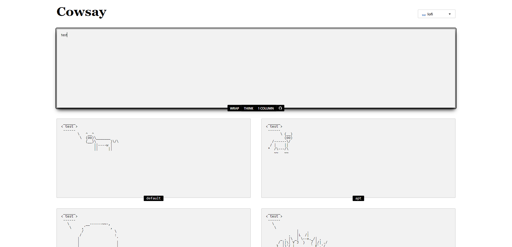

# Cowsay 🐄

## Screenshots



## To do

- [ ] Find formula based on condition [`state2`](/src/App.jsx/#L241) >= [`lg:grid-cols-2`](/src/App.jsx/#L277)

## Tree files

```text
📂README
 ┗ 📂images
 ┃ ┗ 📂screenshots
 ┃ ┃ ┗ 0.png

📂src
 ┣ 📂assets
 ┃ ┗ react.svg
 ┣ App.css
 ┣ App.jsx
 ┣ index.css
 ┗ main.jsx
```

## Development

```text
 _______________
/ $ npm install \
\ $ npm run dev /
 ---------------
        \   ^__^
         \  (oo)\_______
            (__)\       )\/\
                ||----w |
                ||     ||
```
